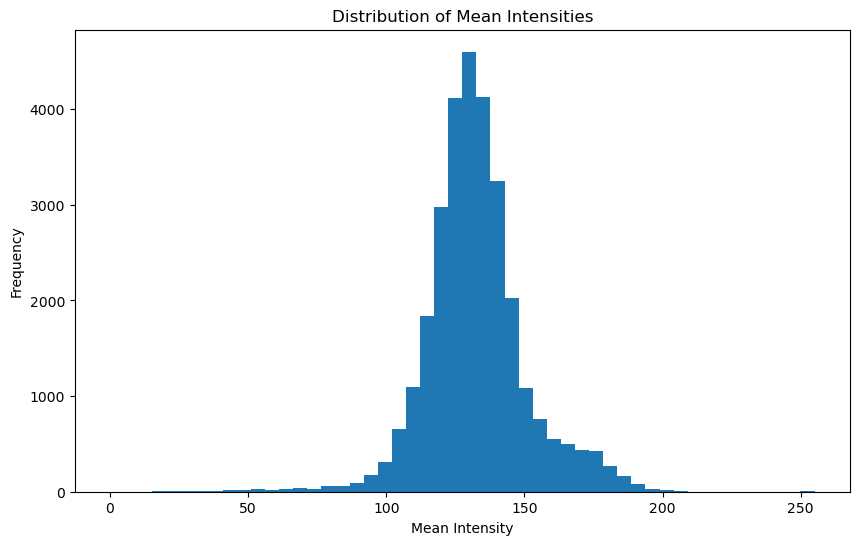
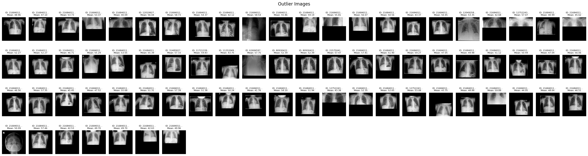
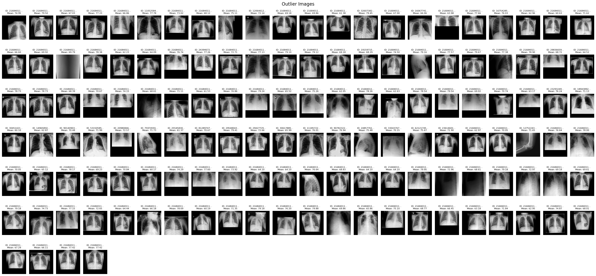
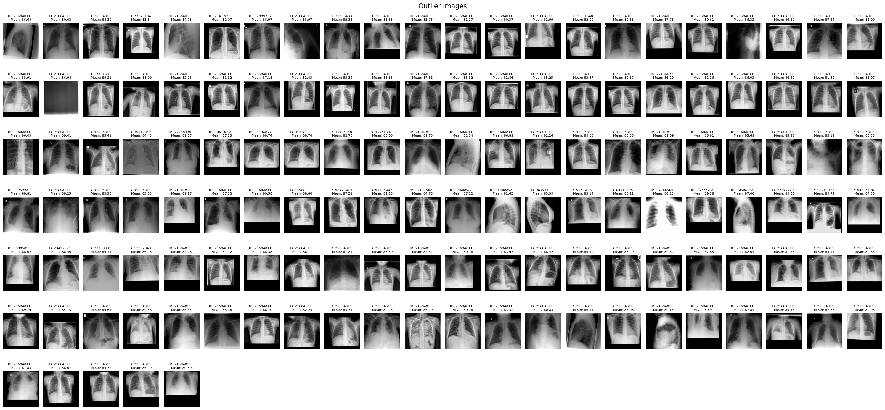

- Effusion (삼출)은 여러 질환과 겹쳐서 보이며, 특히 **Cardiomegaly**, **Atelectasis**, **Pneumonia**, **Edema**와 자주 함께 나타남.

- Consolidation (경화)과 Pneumonia (폐렴)은 겹쳐서 보이는 경우가 많음.

- Cardiomegaly (심비대)는 **Edema (부종)**, Fibrosis (섬유증)와도 상당한 비율로 함께 보임.

## Statistical Summary

|       |  MeanIntensity  |  StdIntensity  |
|-------|-----------------|----------------|
| count |   29907.000000  |   29907.000000 |
| mean  |     132.501841  |      61.589683 |
| std   |      18.265548  |       7.432444 |
| min   |       0.000000  |       0.000000 |
| 25%   |     122.430355  |      56.581343 |
| 50%   |     131.145408  |      61.941231 |
| 75%   |     140.842614  |      66.643990 |
| max   |     255.000000  |      98.918511 |

## Histograms

### Overall Histogram

### Intensity Ranges

#### `lower_bound = 0` and `upper_bound = 40`

#### `lower_bound = 40` and `upper_bound = 60`

#### `lower_bound = 80` and `upper_bound = 90`

#### `lower_bound = 90` and `upper_bound = 100`

#### `lower_bound = 180` and `upper_bound = 256`

